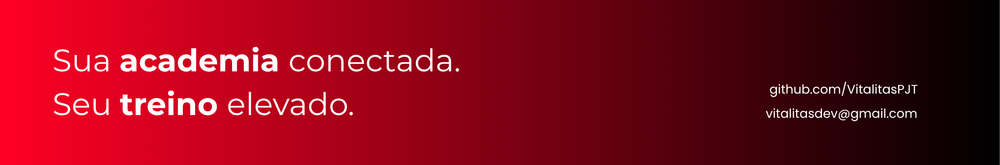
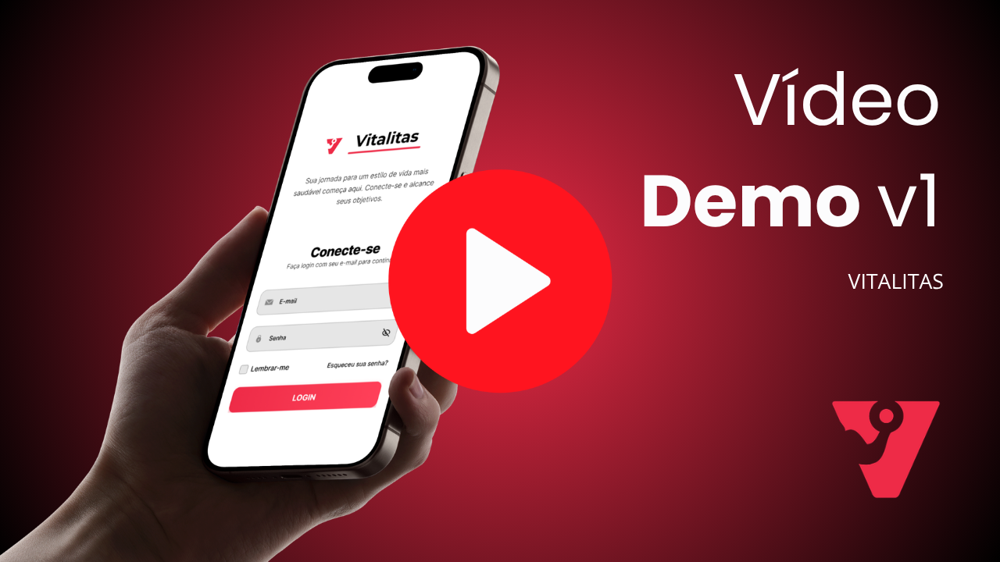

# Vitalitas
<div align="center">



</div>

> **Plataforma Multiplataforma (Web e Mobile) Integrada para Revolucionar a Gestão e a Experiência em Academias.**


<div align="center">


</div>

## Demo

<div align="center">

[](https://www.youtube.com/watch?v=cthOILkzPQ0)

</div>

## Visão Geral do Projeto

### O Problema
Muitas academias ainda realizam a gestão de alunos, treinos e avaliações físicas através de processos manuais, planilhas desconexas ou ferramentas fragmentadas. Esse cenário resulta em:
* **Retrabalho operacional** e baixa eficiência administrativa.
* **Inconsistência de dados**, dificultando a tomada de decisão.
* **Experiência limitada** para o aluno, sem acompanhamento digital de sua evolução.

### A Solução Vitalitas
O **Vitalitas** propõe uma plataforma multiplataforma (web e mobile) que centraliza as informações operacionais, administrativas e técnicas da academia.

A entrega de valor do projeto baseia-se em quatro pilares:
1.  **Centralização:** Dados de alunos, contratos, treinos e avaliações em um único lugar.
2.  **Eficiência:** Automação de tarefas repetitivas e controle de acesso hierárquico.
3.  **Confiabilidade:** Segurança da informação e integridade dos dados de saúde.
4.  **Escalabilidade:** Arquitetura em nuvem preparada para crescimento, com uma API robusta servindo simultaneamente o portal web de gestão e o aplicativo mobile dos alunos.

> Para uma visão estruturada do problema e solução, acesse o slide 5W2H:
> [](media/5w2h-vitalitas.pdf)


## Escopo do Projeto (MVP)

O escopo atual foca no **Produto Mínimo Viável (MVP)**.
O objetivo é entregar um conjunto funcional que permita a operação básica da academia, validando a solução em ambiente real.

### MVP — Fase 1 (em construção)

| # | Funcionalidade | Status |
|---|---|---|
| 01 | Autenticação e controle de acesso | ✅ Entregue (Sprint 2) |
| 02 | Gestão de usuários (wizard por perfil, hierarquia, soft delete) | ✅ Entregue (Sprint 2) |
| 03 | Prontuário médico em dois níveis (ficha base + PAR-Q, FANTASTIC, Borg, EVA) | 🔧 Em desenvolvimento |
| 04 | Perfil profissional do Instrutor (CREF, especialidades, formação, bio, foto) | 🔧 Em desenvolvimento |
| 05 | Prescrição de fichas de treino (exercício, séries, reps, carga kg, descanso seg) | 🔧 Em desenvolvimento |
| 06 | Confirmação de treino + feedback de sessão pelo Aluno | 🔧 Em desenvolvimento |
| 07 | Portal do Aluno — app mobile (ficha ativa, histórico, prontuário, dados pessoais) | 🔧 Em desenvolvimento |
| 08 | Avaliação física (Pollock 7 dobras, %G, circunferências, gráfico de evolução) | 🔧 Em desenvolvimento |
| 09 | Agendamento de avaliações físicas (solicitação pelo Aluno + confirmação pelo Instrutor) | 🔧 Em desenvolvimento |
| 10 | Dashboard do Gestor — BI básico (ativos, inadimplentes, frequência, exportação) | 🔧 Em desenvolvimento |
| 11 | Logs de atividade e auditoria (12 meses, acesso por Gestor e Administrador) | 🔧 Em desenvolvimento |

### Backlog Pós-MVP — Fase 2 (sprints a definir)

| # | Grupo | Funcionalidade |
|---|---|---|
| 12 | Comunicação | Contratos em PDF (upload por Gestor/Admin, download pelo Aluno) |
| 13 | Comunicação | Vídeos de comunicação interna (upload e visualização por todos os perfis) |
| 14 | Financeiro | Gestão financeira da academia via API de terceiros |
| 15 | Financeiro | Visualização de mensalidade pelo Aluno no app |
| 16 | Inteligência Artificial | IA para interpretação de resultados de avaliações físicas |
| 17 | Gamificação | Sistema de XP por frequência + ranking interno por academia |
| 18 | Licenciamento | Landing page e vitrine comercial para contratação autônoma de licenças |

**Resumo:** 11 funcionalidades no MVP (2 entregues, 9 em desenvolvimento) + 7 no backlog pós-MVP = **18 funcionalidades no total**.

## Contexto Acadêmico

O **Vitalitas** é desenvolvido no âmbito da disciplina de **Projeto Integrador** do curso de Ciência da Computação do **Centro Universitário de Brasília (UniCEUB)**.

Esta iniciativa integra a proposta pedagógica da instituição, simulando um ambiente real de desenvolvimento de software com as seguintes características:

* **Orientação Docente:** Todo o ciclo de vida do projeto, da concepção à entrega, é supervisionado por professores especialistas.
* **Multidisciplinaridade:** A solução aplica conhecimentos de diversas áreas, incluindo:
    * *Engenharia de Software* (Processos e Requisitos)
    * *Banco de Dados* (Modelagem e SQL)
    * *Programação Web* (Frontend e Backend)
    * *Arquitetura de Sistemas* (Padrões e Cloud Computing)
* **Metodologia Ágil:** A equipe utiliza abordagens ágeis para planejamento, desenvolvimento incremental e validação contínua.

## Tecnologias e Repositórios

O projeto está dividido em dois repositórios principais, cada um focado em uma parte da solução.

### Frontend & Mobile (Interface Web e App do Aluno)
Responsável pela experiência do usuário em ambas as plataformas — portal web de gestão e aplicativo mobile dos alunos — construído em um monorepo com foco em produtividade e tipagem estática.

* **Stack Web:** React, TypeScript, Bootstrap, Vite.
* **Stack Mobile:** React Native, TypeScript.
* **Bibliotecas:** Axios, React Router DOM, React Navigation, JWT-decode.
* **Repositório:** [VitalitasPJT/vitalitas-frontend-app](https://github.com/VitalitasPJT/vitalitas-frontend-app)
* **Link para Figma com telas de exemplo:** ()


### Backend (API & Dados)
Responsável pelas regras de negócio, segurança e persistência dos dados.

* **Stack:** .NET 8 (ASP.NET Core), C#.
* **Banco de Dados:** SQL Server 2022 Express.
* **Infraestrutura:** Microsoft Azure (App Service + SQL Database).
* **Segurança:** JWT (JSON Web Tokens).
* **Repositório:** [VitalitasPJT/vitalitas-backend](https://github.com/VitalitasPJT/vitalitas-backend)


## Estrutura do Projeto

```text
VitalitasPJT/
├── vitalitas-frontend-app/  # Monorepo: web e mobile
│   ├── .expo/
│   ├── apps/                # Códigos fonte do projeto
│   │   ├── mobile/
│   │   └── web/
│   ├── docs/
│   └── README.md
├── vitalitas-backend/       # Códigos backend do projeto
│   ├── src/                 # Código fonte backend
│   └── README.md
├── evidencias/              # Prints, vídeos e evidências de desenvolvimento
├── .github/
│   ├── profile/
│   │   ├── media/               # Vídeo demo e slides do projeto
│   │   └── README.md
│   └── README.md
└── README.md
```

## Equipe de Desenvolvimento

A equipe do projeto **Vitalitas** possui papéis bem definidos para garantir a cobertura de todas as áreas da Engenharia de Software:

### Gestão e Liderança
* **Sanderson de Oliveira Machado** - *Gerente de Projeto / P.O. / Tech Lead*
    * **Atribuições:** Gerenciamento de escopo e cronograma, definição do backlog (Product Owner) e liderança da arquitetura Backend.
    * 📧 [sanderson.oliveira@sempreceub.com](mailto:sanderson.oliveira@sempreceub.com)
    * [](https://www.linkedin.com/in/sandersonnexum) [](https://github.com/sandersonnexum)

### Frontend & UX
* **Arthur Guarita Brasil** - *Tech Lead Front-end & Mobile / UX UI Designer*
    * **Atribuições:** Prototipação de telas, definição de UX e liderança técnica do desenvolvimento da interface web e mobile.
    * 📧 [arthur.guarita@sempreceub.com](mailto:arthur.guarita@sempreceub.com)
    * [](https://www.linkedin.com/in/arthur-guarit%C3%A1-brasil-09384b379/) [](https://github.com/arthurguaritabrasil)

* **Iuri Guimarães Pinheiro** - *Desenvolvedor Front-End*
    * **Atribuições:** Implementação de componentes visuais, integração com a API e manutenção do código cliente.
    * 📧 [iuri.gp@sempreceub.com](mailto:iuri.gp@sempreceub.com)
    * [](https://www.linkedin.com/in/iuri-guimar%C3%A3es-pinheiro-97159b310/) [](https://github.com/IuriGP)

### Backend & Dados
* **Hugo Ferreira Matos** - *Scrum Master / DBA / QA (Quality Assurance)*
    * **Atribuições:** Facilitação das cerimônias ágeis, remoção de impedimentos, modelagem de dados (DER-MER), criação de scripts SQL e execução de testes de qualidade para estabilidade do sistema.
    * 📧 [hugo.fmatos@sempreceub.com](mailto:hugo.fmatos@sempreceub.com)
    * [](https://www.linkedin.com/in/hugo-ferreira-matos-265b0426b?utm_source=share_via&utm_content=profile&utm_medium=member_android) [](https://github.com/HugoFMat)

* **Pedro Luiz Souza de Abreu** - *Desenvolvedor Back-end*
    * **Atribuições:** Desenvolvimento de APIs e serviços, implementação de regras de negócio e integração com banco de dados.
    * 📧 [pedro.la@sempreceub.com](mailto:pedro.la@sempreceub.com)
    * [](https://www.linkedin.com/in/pedro-luiz-abreu-90a849355/) [](https://github.com/Pedrolsza)

* **Giovanna Couto Lacerda** - *Auxiliar Geral / Analista de Requisitos*
    * **Atribuições:** Apoio às cerimônias ágeis e documentação detalhada dos requisitos do sistema.
    * 📧 [giovanna.couto@sempreceub.com](mailto:giovanna.couto@sempreceub.com)
      <!-- * [](LINK_DO_LINKEDIN) [](LINK_DO_GITHUB) -->

## Licença

Este projeto está sendo desenvolvido exclusivamente para fins acadêmicos na disciplina de Projeto Integrador do Centro Universitário de Brasília (UniCEUB) e foi atualizado completamente no 7º semestre (09 de junho 2026).

Copyright © 2026 Vitalitas. Todos os direitos reservados.
